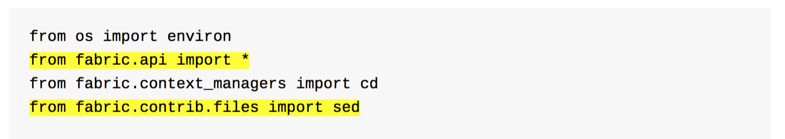

# gitbook-plugin-code-highlighter
GitBook plugin to highlight specific lines in code blocks.

## Example
Here are a couple of highlighted [Python](https://www.fullstackpython.com/) 
code lines using a yellow background:
 

## Plugin Installation
1. Make sure you have [GitBook](https://github.com/GitbookIO/gitbook) 
   and the [gitbook-cli](https://github.com/GitbookIO/gitbook-cli) 
   installed.

1. The default **highlight** plugin that is built into GitBook must be disabled,
   as shown in the below example `book.json`. The default highlighter prevents 
   other plugins from processing code blocks.

        {
            "author": "Matthew Makai",
            "cover": "cover.jpg",
            "gitbook": "2.x.x",
            "plugins": ["-highlight", "code-highlighter"],
            "title": "The Full Stack Python Guide to Deployments",
            "pdf": {
                "pageNumbers": true,
                "headerTemplate": " ",
                "footerTemplate": " "
            }
        }

1. Run `gitbook install` to pull down 
   [the latest plugin version from NPM](https://www.npmjs.com/package/gitbook-plugin-code-highlighter).
